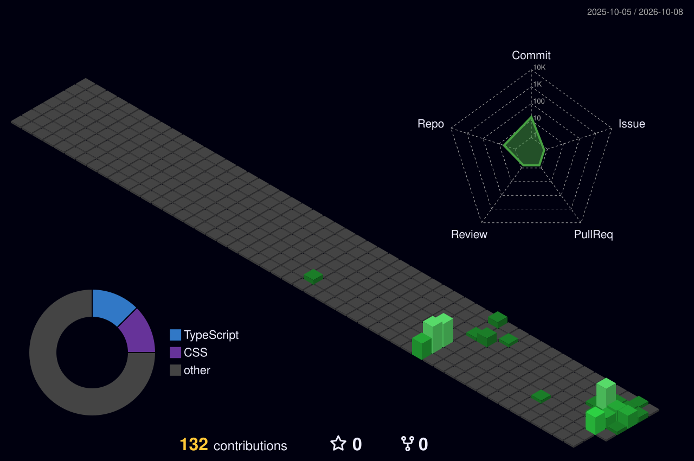

  <!-- Animated Header Banner -->
  

  <!-- Animated Typing Headline -->
  

  

    
    
    
  

---

### Contributions

  

---

### 🚀 Tech Stack & Tooling

  

---

### 📊 GitHub Activity & Metrics

  <table>
    <tr>
      <td width="50%" align="center">
        <!-- GitHub Stats Card (Dark / Emerald Green Theme) -->
        
      </td>
      <td width="50%" align="center">
        <!-- Streak Stats Card -->
        
      </td>
    </tr>
  </table>

  <!-- Most Used Languages Bar -->
  

---

### 🌐 Connect With Me

  

 

  

 

  

